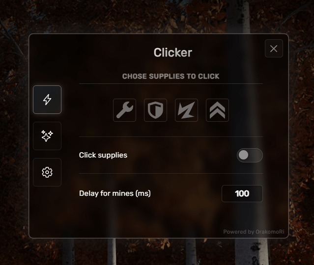

# CHANGELOG

## [5.0.1] - 2025-10-22

### Changed

- Migrated builds hosting from GitHub raw to Vercel for improved stability
- Updated download URLs to use GitHub Pages
- Improved CDN caching with cache-busting timestamps
- Changelog formatting standardization

### Fixed

- Event propagation issues in popup window (focus and keydown)
- Build workflow optimization (removed redundant checks)

## [5.0.0] - 2025-10-20

### Added

- :tada: Complete project rewrite with modern website :tada:
- Automated `GitHub Actions` for builds and releases
- Webpack bundling for production
- Interactive console demo on landing page
- Download manager with auto-detection of latest stable version

### Changed

- Project structure from monolithic to modular architecture
- Migrated to `ES6` modules
- Updated to `Webpack 5`
- Improved popup window `UI`/`UX`
- Enhanced mobile responsiveness
- Modernized `CSS` with custom properties

### Fixed

- Cross-browser inconsistencies
- Performance optimizations
- Memory leaks in event listeners

### Removed

- Mobile device support

### Look of the popup window:



## [4.0.2] - 2024-10-19

### Fixed

- Behavior of mine delay input in a window that has some interactive canvas(es)

## [4.0.1] - 2024-06-07

### Changed

- Userscript now uses built-in commands to update the script
- Method of script auto-update
- Method of script loading

### Fixed

- Update popup from SweetAlert2
- Links for downloading and updating the script
- Styles for sweetalert2

## [4.0.0] - 2024-03-19

### Added

- :tada: ```CHANGELOG.md``` to record changes :tada:
- Source icons in the repository
- NodeJS to compile source JS files into one minified script
- Icons for mobile devices with quick actions
- CSS support for popup window on mobile devices
- Ability to remove hotkeys at will (icon / hotkey)
- If different actions are binded to the same hotkey, these hotkeys will have yellow border in the settings tab

### Changed

- Renamed to "Diaphantium"
- Renamed the function ```popupMove()``` to ```elementMove()```; changed the function, so it can be applied to every element
- Now function ```elementMove()``` also works on mobile devices
- Renamed the function ```initializePopup()``` to ```elementInitialize()```; now it can work with any element
- Also added support to the ```elementInitialize()``` function for complex items from ```localStorage```, e.g. ```item: {name: '', value: ''}, {name: '', value: ''}```; they can be saved via ```item[index]``` and retrieved the same way
- Optimized hotkeys' appearance to support different languages (if I were to add them later on)
- Demo website update
- Popup styles update (less rounded edges)

### Fixed

- Modified mine delay check when closing popup. Now it should be fine!
- The behavior of hotkeys when they are pressed inside some `inputs`
- Bugs related to device's orientation change

### Removed

- Removed battle actions due to instability
- Removed user nickname blur feature
- Removed 'skip login' feature

### Look of the popup window on computers:


### Look of the popup window and icons on mobile devices:


## [3.0.0] - 2023-08-25

### Added

- Tab with action buttons for selected battles to click in the battle automatically
- User nickname blur feature
- 'Skip login' feature to skip annoying login steps

### Changed

- Main window improved with enhanced UI

### Fixed

- Popup movement restrictions (previously only worked with colored rectangle)

### The main window was impoved one more time:


## [2.0.0] - 2023-06-23

### Added

- Popup with 2 tabs: main and settings
- Ability to move popup by the colored rectangle
- Project functionality

### Main tab design:


## [1.0.0] - 2023-05-25

### Added

- Initial popup with useful functions
- Basic project structure

### First take:

