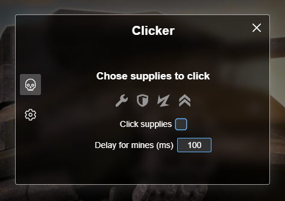
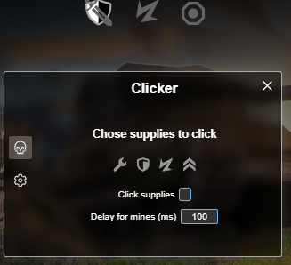
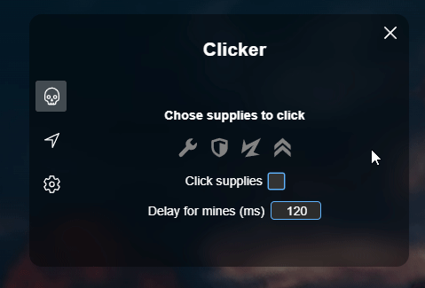
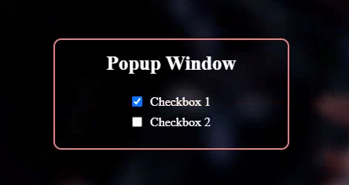

# CHANGELOG

## 4.0.0 (19.03.2024)

### Added

- :tada: ```CHANGELOG.md``` to record changes :tada:
- Source icons in the repository
- NodeJS to compile source JS files into one minified script
- Icons for mobile devices with quick actions
- CSS support for popup window on mobile devices
- Ability to remove hotkeys at will (icon / hotkey)
- If different actions are binded to the same hotkey, these hotkeys will have yellow border in the settings tab

### Changed

- Renamed to "Diaphantium"
- Renamed the function ```popupMove()``` to ```elementMove()```; changed the function, so it can be applied to every element
- Now function ```elementMove()``` also works on mobile devices
- Renamed the function ```initializePopup()``` to ```elementInitialize()```; now it can work with any element
- Also added support to the ```elementInitialize()``` function for complex items from ```localStorage```, e.g. ```item: {name: '', value: ''}, {name: '', value: ''}```; they can be saved via ```item[index]``` and retrieved the same way
- Optimized hotkeys' appearance to support different languages (if I were to add them later on)
- Demo website update
- Popup styles update (less rounded edges)

### Fixed

- Modified mine delay check when closing popup. Now it should be fine!
- The behavior of hotkeys when they are pressed inside some ```inputs```
- Bugs related to device's orientation change

### Look of the popup window on computers:



### Look of the popup window and icons on mobile devices:



---

## 3.0.0 - 3.x.x (25.08.2023)

More than 150 commits were pushed to git before the project was ready to take the next step into 3.x.x versions.

### The main window was impoved one more time:



On the screenshot the three navigation buttons can be seen (left side). The middle button appeared only when user had selected battle in pro battles list. This button would lead the user to a tab where user would see action buttons. If the selected battle was a team battle on the tab were rendered three buttons: 'click alfa', 'click both' and 'clich bravo'. Alternatively, if the battle mode was DM (deathmatch) then only one button was rendered: 'click in'.

It was deleted later on as it was too unstable in my opinion.

Also, in the settings tab 2 more features were added: user nickname blur and 'skip login' that skipped many annoying steps on the login stage.

---

## 2.0.0 - 2.x.x (23.06.2023)

After many patches and days of work the result was finally published on github. The popup had 2 tabs: main and settings.

### Main tab design:


It has many bugs and weaknesses, for example the popup could be moved on the screen only by colored rectangle on the top-left side of the window (pink on the screenshot). In the next 2 days I improved the code, so the user could move the popup by any part of the window except input fields.

---

## 1.0.0 - 1.x.x (25.05.2023)

The idea was to create a popup which would have some useful functions.

### First take:



The project took almost a month of work untill I finished the first unstable release.

---