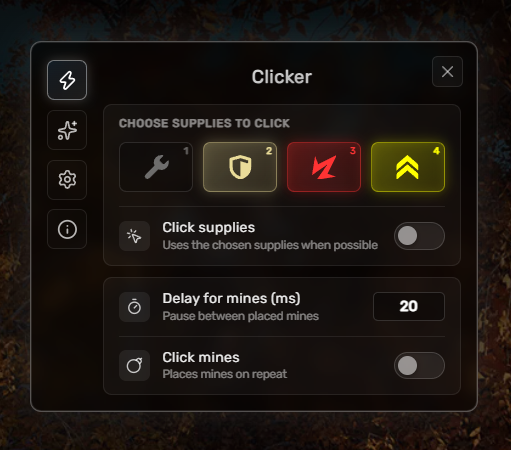
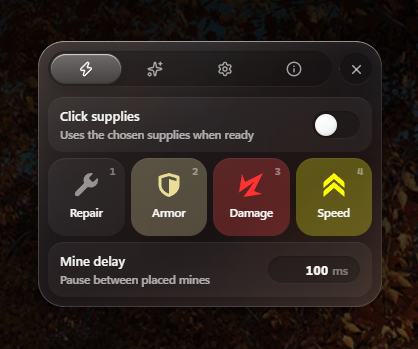
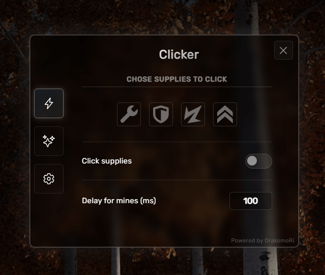
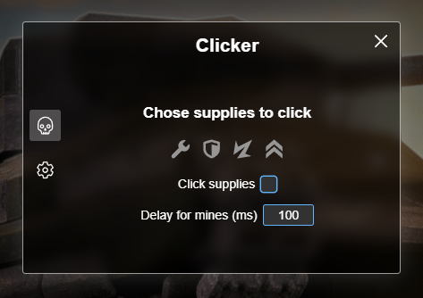
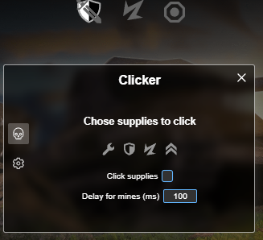
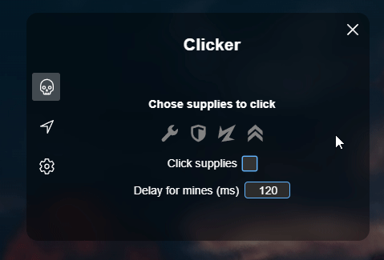
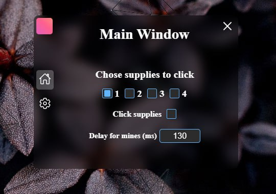
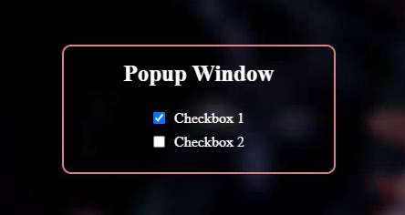

# CHANGELOG

## [6.0.0] - 2026-09-20

### Added

- Plugin API for other userscripts to add a settings toggle, take over a click feature, add translations or a whole new language, and keep their own isolated storage :tada:
- Branch channels and a development userscript for testing builds before release :tada:
- About tab with version, release date, author, licence and a link to the repository
- Second panel theme, Liquid glass, with its own layout and animations
- Language setting: Auto, English, Русский or Українська
- Tooltips explaining every control
- Toggle for click mines in the Clicker tab, next to mine delay
- Automated unit tests, run by CI before publishing
- Interface size setting (80%, 100%, 125%, 150%, 200%) in Settings, in both themes: the whole panel, its hints and lists, and the settings added by plugins scale together with a smooth transition around the panel's anchored corner, and the panel is drawn smaller than chosen only when the window cannot hold it

### Changed

- Loader rewritten in TypeScript, clicker rewritten in Vue 3 with TypeScript :tada:
- Panel rebuilt as a persistent shadow-root host, more compact and responsive, with smoother animations and dragging
- Supplies, auto self-destruct, mines and anti-AFK now run on a shared clock that keeps ticking even when the window is minimized or unfocused, instead of stalling like before
- Supply and auto self-destruct presses capped so they no longer multiply on high refresh rate monitors - Menu, close and hotkey reset icons switched from Ionicons to Lucide
- Supported browsers raised to Chrome/Edge 121+, Safari 16.4+, Firefox 114+, Opera 97+; mobile support is no longer listed

### Fixed

- Panel could end up off-screen or misplaced after resizing the window or a quick drag-and-close
- Toggling supplies, auto self-destruct, mines or anti-AFK off and on quickly could start duplicate loops running in the background
- A setting changed right before closing or reloading the page was not saved
- Assorted smaller bugs: a typo, a stray focus ring, console log colours, git hooks on a fresh clone
- The Tampermonkey bridge injected a fetched response as a script even on a non-200 HTTP status (e.g. a 404 page from the build CDN), throwing a `SyntaxError` in the page instead of surfacing the actual network error

### Look of the classic theme:

### Look of the liquid glass theme:

## [5.0.2] - 2026-05-02

### Added

- New API endpoints:
    - for latest stable web build: https://diaphantium-builds.vercel.app/api/stable/web
    - for latest stable client build: https://diaphantium-builds.vercel.app/api/stable/client (currently there's no client build)

### Changed

- Updated project structure for better maintainability (rollup instead of webpack)
- Updated the demo website

## [5.0.1] - 2025-10-22

### Changed

- Migrated builds hosting from GitHub raw to Vercel for improved stability
- Updated download URLs to use GitHub Pages
- Improved CDN caching with cache-busting timestamps
- Changelog formatting standardization

### Fixed

- Event propagation issues in popup window (focus and keydown)
- Build workflow optimization (removed redundant checks)

## [5.0.0] - 2025-10-20

### Added

- Complete project rewrite with modern website :tada:
- Automated `GitHub Actions` for builds and releases
- Webpack bundling for production
- Interactive console demo on landing page
- Download manager with auto-detection of latest stable version

### Changed

- Project structure from monolithic to modular architecture
- Migrated to `ES6` modules
- Updated to `Webpack 5`
- Improved popup window `UI`/`UX`
- Enhanced mobile responsiveness
- Modernized `CSS` with custom properties

### Fixed

- Cross-browser inconsistencies
- Performance optimizations
- Memory leaks in event listeners

### Removed

- Mobile device support

### Look of the popup window:

## [4.0.2] - 2024-10-19

### Fixed

- Behavior of mine delay input in a window that has some interactive canvas(es)

## [4.0.1] - 2024-06-07

### Changed

- Userscript now uses built-in commands to update the script
- Method of script auto-update
- Method of script loading

### Fixed

- Update popup from SweetAlert2
- Links for downloading and updating the script
- Styles for sweetalert2

## [4.0.0] - 2024-03-19

### Added

- `CHANGELOG.md` to record changes :tada:
- Source icons in the repository
- NodeJS to compile source JS files into one minified script
- Icons for mobile devices with quick actions
- CSS support for popup window on mobile devices
- Ability to remove hotkeys at will (icon / hotkey)
- If different actions are binded to the same hotkey, these hotkeys will have yellow border in the settings tab

### Changed

- Renamed to "Diaphantium"
- Renamed the function `popupMove()` to `elementMove()`; changed the function, so it can be applied to every element
- Now function `elementMove()` also works on mobile devices
- Renamed the function `initializePopup()` to `elementInitialize()`; now it can work with any element
- Also added support to the `elementInitialize()` function for complex items from `localStorage`, e.g. `item: {name: '', value: ''}, {name: '', value: ''}`; they can be saved via `item[index]` and retrieved the same way
- Optimized hotkeys' appearance to support different languages (if I were to add them later on)
- Demo website update
- Popup styles update (less rounded edges)

### Fixed

- Modified mine delay check when closing popup. Now it should be fine!
- The behavior of hotkeys when they are pressed inside some `inputs`
- Bugs related to device's orientation change

### Removed

- Removed battle actions due to instability
- Removed user nickname blur feature
- Removed 'skip login' feature

### Look of the popup window on computers:

### Look of the popup window and icons on mobile devices:

## [3.0.0] - 2023-08-25

### Added

- Tab with action buttons for selected battles to click in the battle automatically
- User nickname blur feature
- 'Skip login' feature to skip annoying login steps

### Changed

- Main window improved with enhanced UI

### Fixed

- Popup movement restrictions (previously only worked with colored rectangle)

### The main window was impoved one more time:

## [2.0.0] - 2023-06-23

### Added

- Popup with 2 tabs: main and settings
- Ability to move popup by the colored rectangle
- Project functionality

### Main tab design:

## [1.0.0] - 2023-05-25

### Added

- Initial popup with useful functions
- Basic project structure

### First take:

