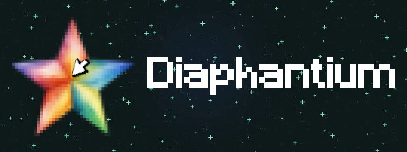

# Diaphantium

### :star: Reborn from ashes...

---

Free open-source tool. Made with love :heart:

The idea was to create a popup with a simple UI that would allow a continuous input on the desired keys.

Check the [demo website](https://orakomori.github.io/Diaphantium/)

```javascript
/* WORK IN PROGRESS */
```

See the [changelog](CHANGELOG.md)

## :rocket: Browser compatibility

To use the code, you'll need the Tampermonkey extension installed. Here's a list of browsers and their compatible/incompatible versions:

### :warning: Warning

- :x: Not compatible with IE11
- :x: Not compatible with Opera Mini
- :x: Does not fully support Safari for iOS

### :white_check_mark: PC

Browser|Version
-|:-:
Google Chrome|121+
Edge|121+
Safary|16+
Firefox|103+
Opera|76+

### :white_check_mark: Mobile

Browser|Version
-|:-:
Opera Mobile|80+
Android Browser|122+
Google Chrome for Android|122+
Firefox for Android|123+
Safary for iOS|16+
Samsung Internet|15+

---

## :fire: Look of the popup window


---

## :bulb: How to use

1. Download [Tampermonkey](https://www.tampermonkey.net/)

2. Add or update [script](https://raw.githubusercontent.com/OrakomoRi/Diaphantium/main/release/diaphantium.user.js) in Tampermonkey

---

## :hash: Default values

Default hotkey to open menu: ```Slash ('/')```

Default mines' delay (ms): ```100```

---

## :zap: Powered by

- [HTML5](https://developer.mozilla.org/en-US/docs/Web/HTML)
- [CSS3](https://developer.mozilla.org/en-US/docs/Web/CSS)
- [JavaScript](https://www.javascript.com/)
- [JQuery](https://jquery.com/)
- [SweetAlert2](https://sweetalert2.github.io/)

---

## :sparkles: Credits

Main developer: [OrakomoRi](https://github.com/OrakomoRi)

Some ideas: [N3onTechF0X](https://github.com/N3onTechF0X)

Special thanks: [Senijs](https://github.com/Senijs)

---

## :coin: Support me

Any donations would be appreciated

- [Boosty](https://boosty.to/orakomori/donate)
- [Patreon](https://www.patreon.com/orakomori)
-  **BTC**: *bc1qujagmeactpljqa03ywhul5zpa62ru9g0280f3c*
- **USDT (BNB Smart Chain)**: *0x8c7393091428d9A3b44fF4436217d8EbD33e7990*
- **USDT (Tron)**: *TQj3EjdQXv8fhRsf3eXWowxz7YpYvYEoLU*
- **USDT (Solana)**: *2UKZe2J4TohqFsF1kQRqmCXqwCcdUJkAvcM6ByZiqds8*