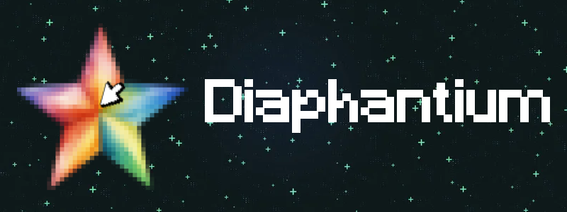

# Diaphantium

## :star: Reborn from ashes...

> Free open-source tool. Made with love :heart:


[](https://github.com/OrakomoRi/Diaphantium/actions/workflows/auto-build-and-release.yml)


The idea was to create a popup with a simple UI that would allow a continuous input on the desired keys. Now evolved into a professional automation userscript for Tanki Online with customizable hotkeys, auto-clicking, and supply management. Features internationalization support, and automated builds.

To find out compatibility, check [browser compatibility](#-browser-compatibility)

Check the [demo website](https://orakomori.github.io/Diaphantium/)

See the [changelog](CHANGELOG.md)

## :bulb: Getting Started

1. Download [Tampermonkey](https://www.tampermonkey.net/)

2. Add or update [script](https://diaphantium-builds.vercel.app/api/stable/web) in Tampermonkey

## :hash: Default Values

Default hotkey to open menu: ```Slash ('/')```

Default mines' delay (ms): ```100```

## :fire: Appearance

### Classic theme


### Liquid glass theme


## :rocket: Browser Compatibility

To use the code, you'll need the Tampermonkey extension installed. Here's a list of browsers and their compatible/incompatible versions:

### :warning: Warning

- :x: Not compatible with IE11
- :x: Not compatible with Opera Mini
- :x: Does not fully support Safari for iOS
- :x: We do not support any mobile browsers

### :white_check_mark: PC

Browser|Version
-|:-:
Google Chrome|121+
Edge|121+
Safari|16.4+
Firefox|114+
Opera|97+

## :zap: Built With

- [TypeScript](https://www.typescriptlang.org/)
- [Vue](https://vuejs.org/) and [Vue I18n](https://vue-i18n.intlify.dev/)
- [Vite](https://vite.dev/)
- [Vitest](https://vitest.dev/) and [Playwright](https://playwright.dev/)
- [Ark UI](https://ark-ui.com/)
- [Lucide](https://lucide.dev/)

## :wave: Special Thanks

- Contributors to logic: [N3onTechF0X](https://github.com/N3onTechF0X), [Senijs](https://github.com/Senijs)

- Contributors to design: [Senijs](https://github.com/Senijs)

## :coin: Support me

Any donations would be appreciated

- [Boosty](https://boosty.to/orakomori/donate)
- [Patreon](https://www.patreon.com/orakomori)
-  **BTC**: *bc1qujagmeactpljqa03ywhul5zpa62ru9g0280f3c*
- **USDT (BNB Smart Chain)**: *0x8c7393091428d9A3b44fF4436217d8EbD33e7990*
- **USDT (Tron)**: *TQj3EjdQXv8fhRsf3eXWowxz7YpYvYEoLU*
- **USDT (Solana)**: *2UKZe2J4TohqFsF1kQRqmCXqwCcdUJkAvcM6ByZiqds8*

## :page_facing_up: License

Distributed under the MIT License. See `LICENSE` for more information.

## :star: Acknowledgments

* [CSS Autoprefixer](https://autoprefixer.github.io/)
